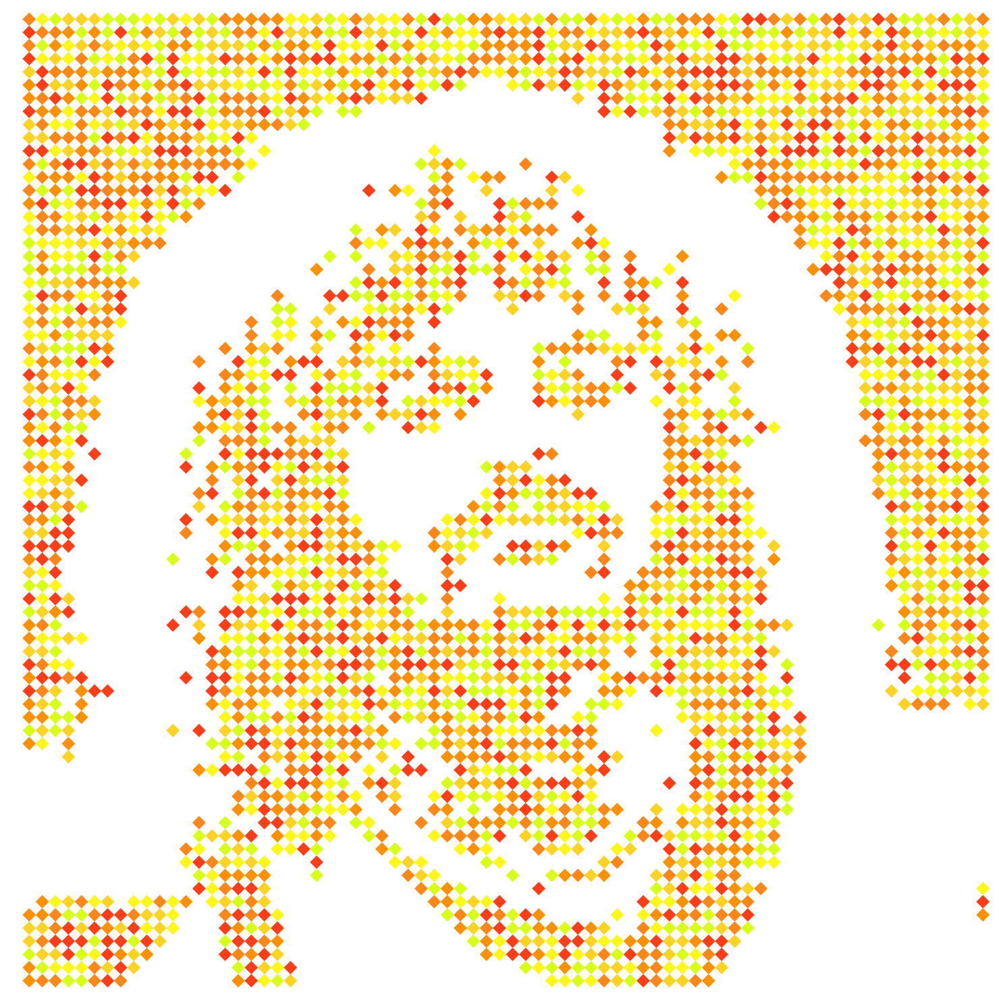
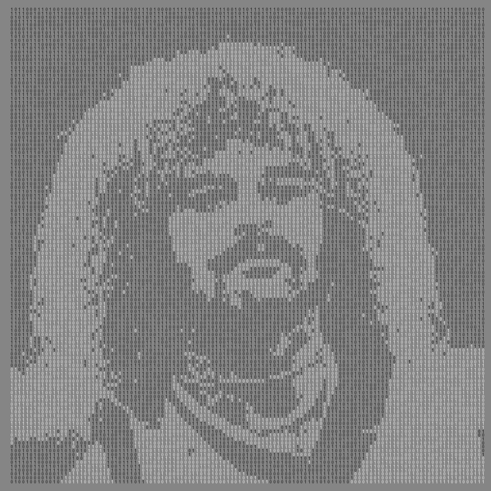
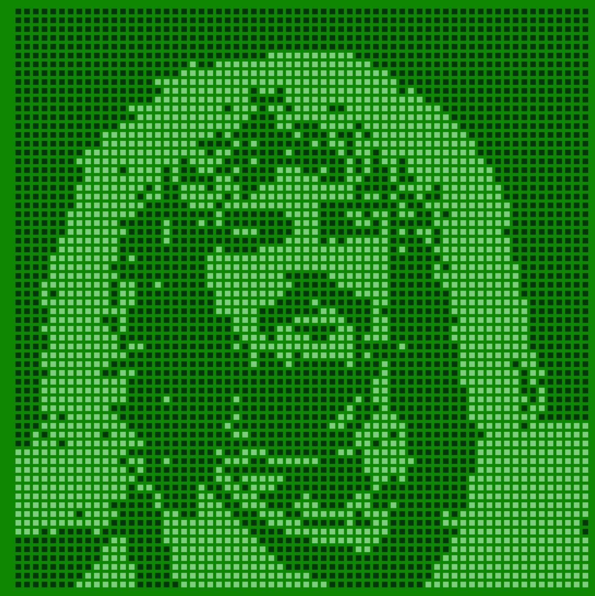
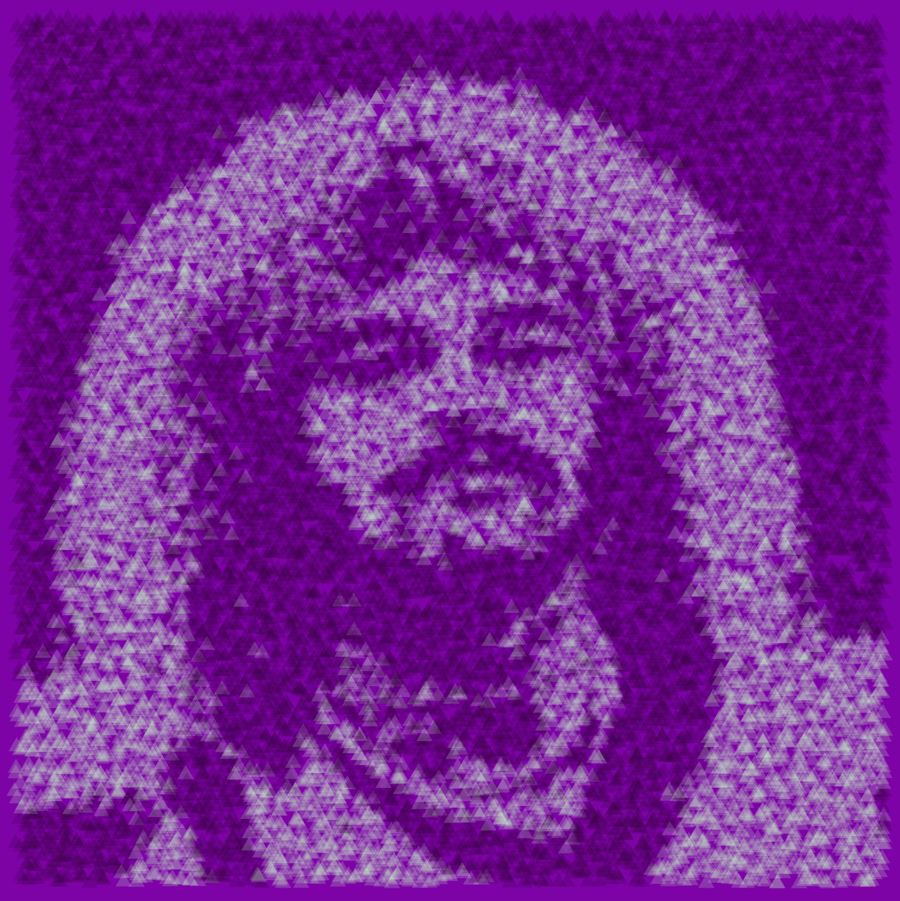
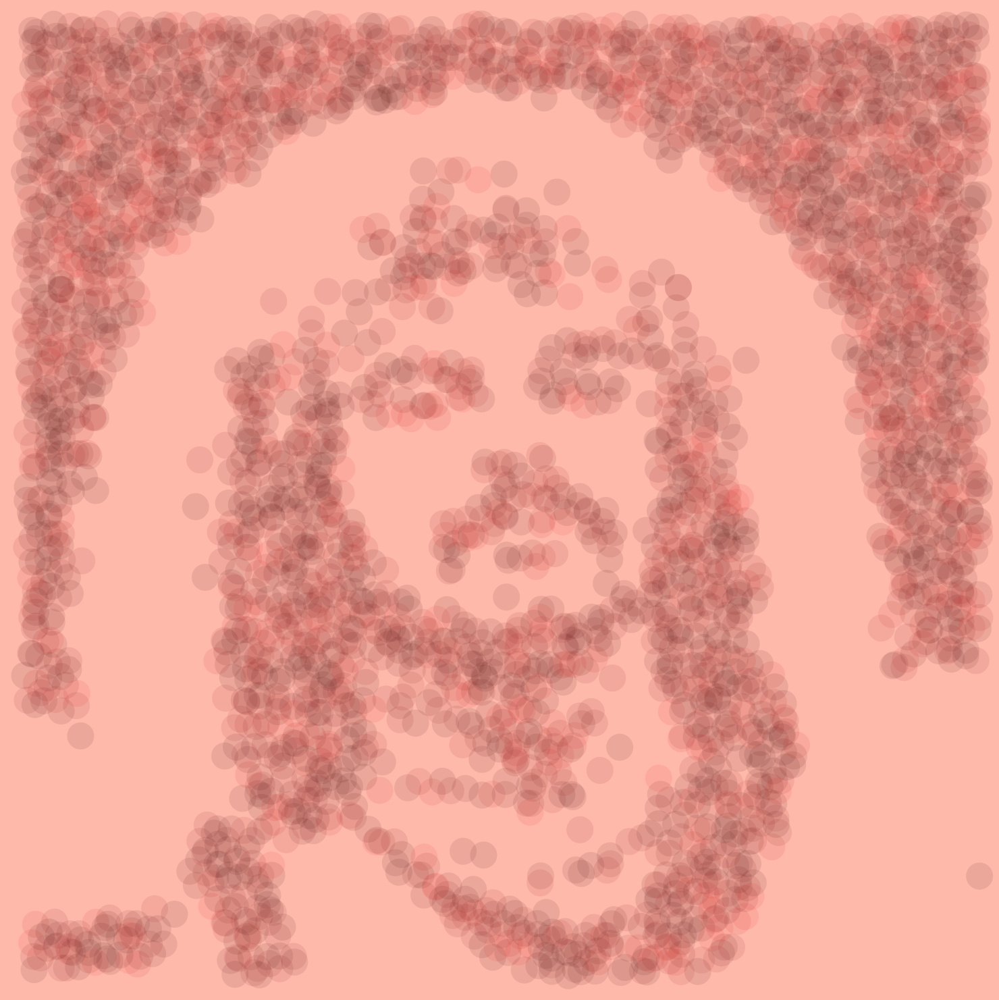
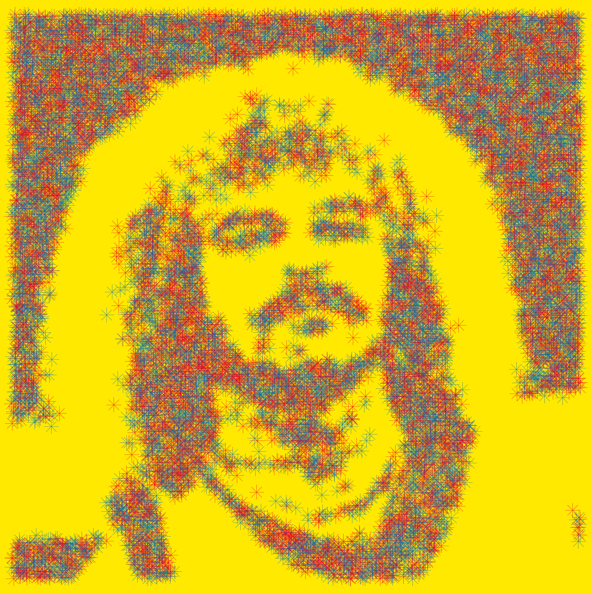
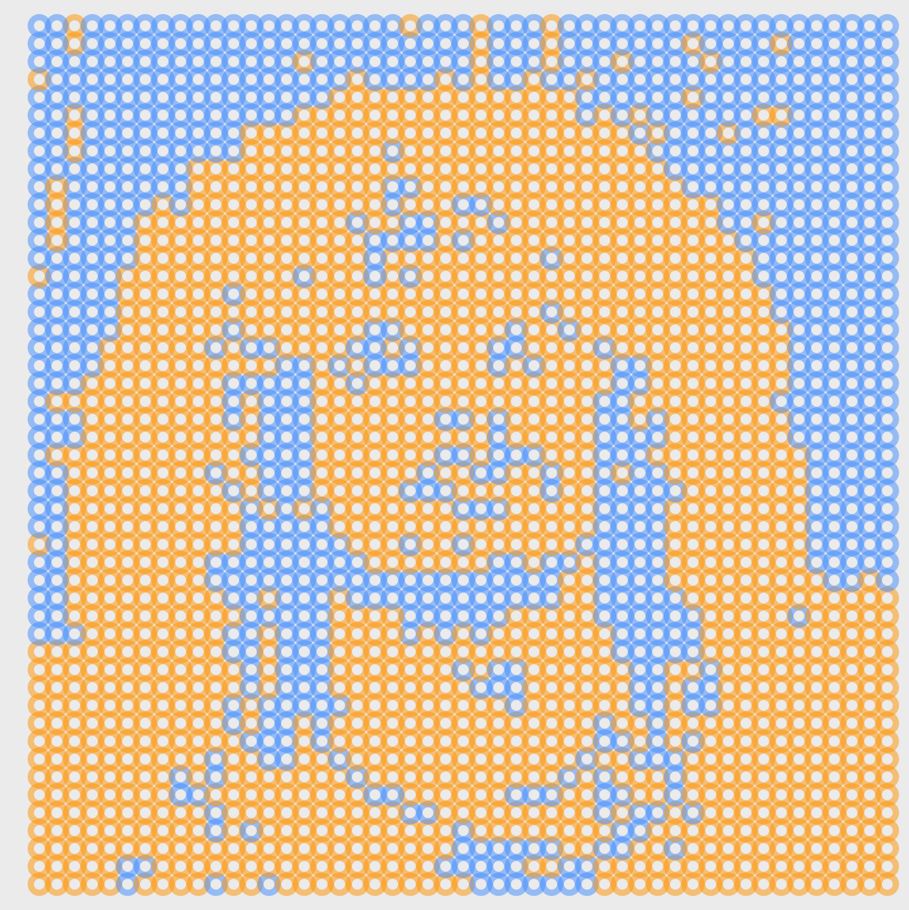
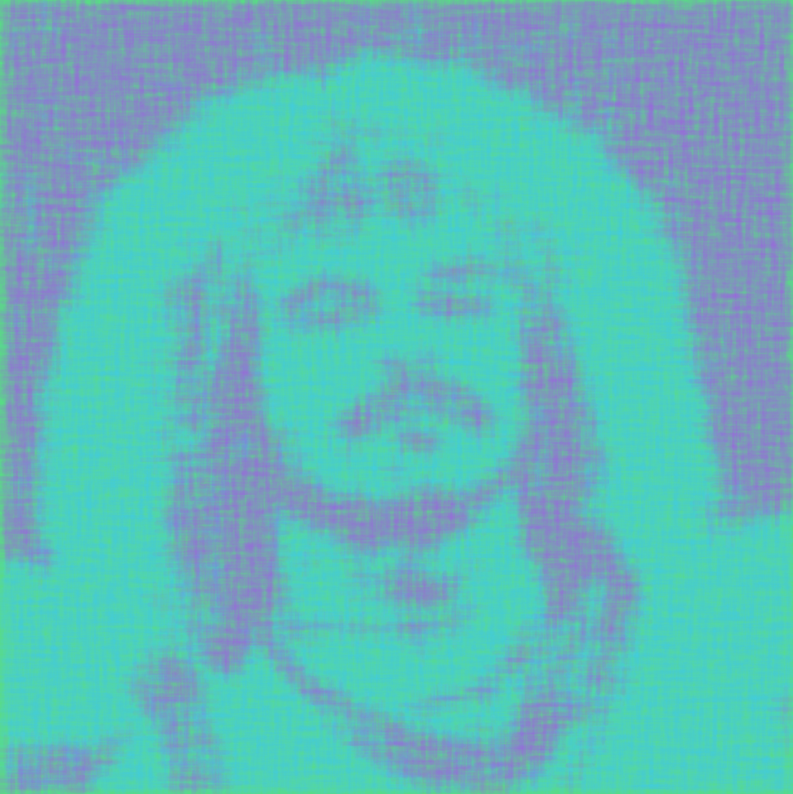

# Creating "binary" pictures

Link to live app: https://roguedatascience.shinyapps.io/binary_images/

  

  
  
  
  
  
  
  
  
  
  
  
  

You can find the high definition images as well as the app settings needed to produce them here: [El Pibe Valderrama example](pibe_example)
